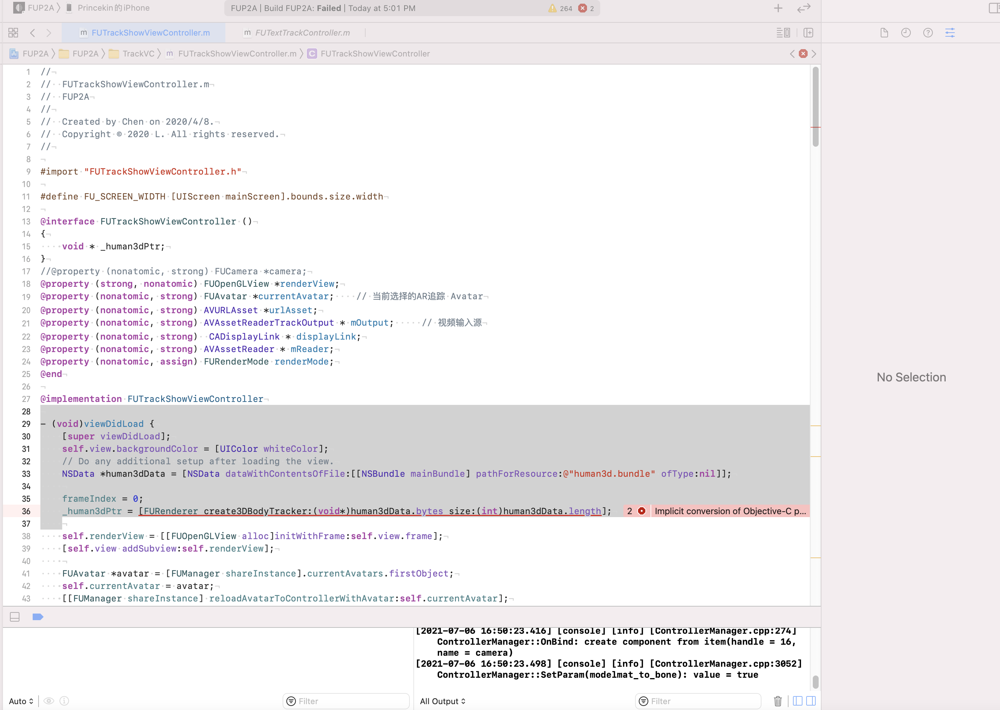
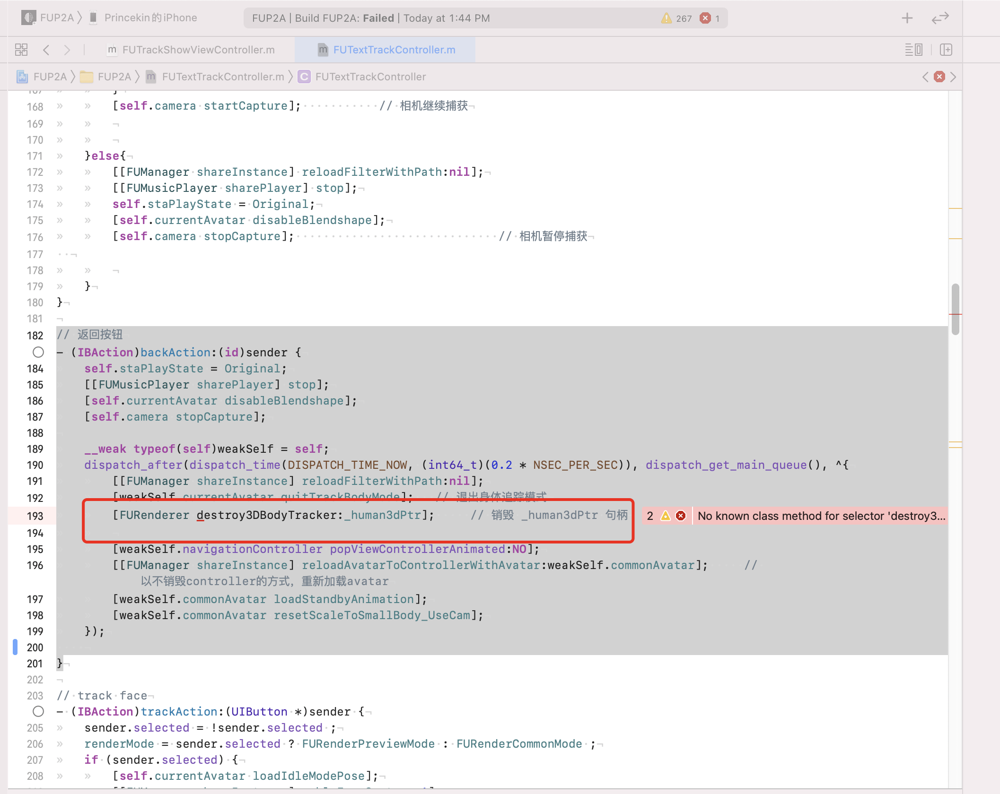

# 文件更新

## 1.FUP2A/Faceunity/FaceUnity-SDK-iOS/Resources/ai_face_processor.bundle ==> FUP2A/Faceunity/FaceUnity-SDK-iOS/Resources/ai_face_processor_e46_s1.bundle；

## 2.更新预制模型  Resource/3/、Resource/4/ 文件夹内素材；

## 3.更新 FUP2A/Faceunity/FaceUnity-SDK-iOS/ 文件夹内所有文件；

## 4.更新 FUP2A/Faceunity/P2A/ 文件夹内所有文件；

# 更新 cnama.a 后
## 1.FUTrackShowViewController.m 文件报错

```

- (void)viewDidLoad {
    // 其他代码
    _human3dPtr = [FURenderer create3DBodyTracker:(void*)human3dData.bytes size:(int)human3dData.length];
    // 其他代码
}
    
```


### 解决办法:
删除报错行

## 2.FUTextTrackController.m 文件报错

```
// 返回按钮
- (IBAction)backAction:(id)sender {
        // 其他代码
		[FURenderer destroy3DBodyTracker:_human3dPtr];     // 销毁 _human3dPtr 句柄
		// 其他代码
}

```



### 解决办法:
删除报错行


# 更新 libpta_client_lite.a 后


## 1.loadClientDataWithFirstSetup 方法会报错，更新为 

```

//初始化P2AClient库
- (void)loadClientDataWithFirstSetup:(BOOL)firstSetup
{
    NSString *qPath;
    if (![[NSFileManager defaultManager] fileExistsAtPath:AvatarQPath])
    {
        [[NSFileManager defaultManager] createDirectoryAtPath:AvatarQPath withIntermediateDirectories:YES attributes:nil error:nil];
    }
    qPath =[[NSBundle mainBundle] pathForResource:@"pta_client_q1_lite" ofType:@"bin"];
    
    // p2a bin
    if (firstSetup)
    {
        NSString *corePath = [[NSBundle mainBundle] pathForResource:@"pta_core_log_all" ofType:@"bin"];
        [fuPTAClientLite setAuth:&g_auth_package authSize:sizeof(g_auth_package)];
        [fuPTAClientLite setData:corePath];
    }
    [fuPTAClientLite setData:qPath];
}

```


## 2.saveAvatar 方法会报错，更新为 

```

//如果是预制形象生成新的形象，如果不是预制模型保存新的信息
- (void)saveAvatar
{
	FUAvatar *currentAvatar = self.currentAvatars.lastObject;
	BOOL deformHead = [[FUShapeParamsMode shareInstance]propertiesIsChanged]||[self faceHasChanged];
	
	//获取保存形象的名字
	NSString *avatarName = currentAvatar.defaultModel ? [NSString stringWithFormat:@"%.0f", [[NSDate date] timeIntervalSince1970]] : currentAvatar.name;
	
	//获取文件路径
	NSFileManager *fileManager = [NSFileManager defaultManager];
	NSString *filePath = [documentPath stringByAppendingPathComponent:avatarName];
	
	if (![fileManager fileExistsAtPath:filePath])
	{
		[[NSFileManager defaultManager] createDirectoryAtPath:filePath withIntermediateDirectories:YES attributes:nil error:nil];
	}
	
	//拷贝head.bundle,如果需要重新生成头拷贝新的head.bundle
	NSData *headData = [NSData dataWithContentsOfFile:[[currentAvatar filePath] stringByAppendingPathComponent:FU_HEAD_BUNDLE]];
	if (deformHead)
	{//deformHead 决定是否生成新头
		NSArray *params = [[FUShapeParamsMode shareInstance]getShapeParamsWithAvatar:self.currentAvatars.firstObject];
		
		float coeffi[100];
		for (int i = 0 ; i < 100; i ++)
		{
			coeffi[i] = [params[i] floatValue];
		}
		//重新生成head.bundle
        int handle = [fuPTAClientLite setBundle:headData];
        [fuPTAClientLite facepup:handle deformParams:coeffi paramsSize:148];
        headData = [fuPTAClientLite getHeadBundle:handle lessBS:NO lowp:NO];
        [fuPTAClientLite releaseHandle:handle];
	}
	[headData writeToFile:[filePath stringByAppendingPathComponent:@"/head.bundle"] atomically:YES];
	
	if (deformHead)
	{
		[currentAvatar bindItemWithType:FUItemTypeHead filePath:[filePath stringByAppendingPathComponent:@"/head.bundle"]];
	}
	
	if (currentAvatar.defaultModel)
	{//如果是预制模型，拷贝头像
		UIImage *image = [UIImage imageWithContentsOfFile:currentAvatar.imagePath];
		NSData *imageData = UIImageJPEGRepresentation(image, 1.0) ;
		[imageData writeToFile:[filePath stringByAppendingString:@"/image.png"] atomically:YES];
	}
	
	//获取并写入数据json
	NSMutableDictionary *avatarDict = [[NSMutableDictionary alloc]init];
	[avatarDict setValue:avatarName forKey:@"name"];
	[avatarDict setValue:@(currentAvatar.gender) forKey:@"gender"];
	[avatarDict setValue:@(0) forKey:@"default"];
	[avatarDict setValue:@(1) forKey:@"q_type"];
	[avatarDict setValue:@(currentAvatar.clothType) forKey:@"clothType"];
	[avatarDict setValue:@(currentAvatar.hairType) forKey:@"hairType"];
	[avatarDict setValue:@(currentAvatar.skinColorProgress) forKey:TAG_FU_SKIN_COLOR_PROGRESS];
	
	[self.selectedItemIndexDict enumerateKeysAndObjectsUsingBlock:^(id  _Nonnull key, id  _Nonnull obj, BOOL * _Nonnull stop) {
		
			if([self.makeupTypeArray containsObject:key]){  // 如果是美妆类型
				NSArray *itemArray = self.itemsDict[FUEditTypeKey(FUEditTypeMakeup)];
				FUItemModel *model = [itemArray objectAtIndex:[obj integerValue]];
				
				if (!currentAvatar.defaultModel)
				{
					[currentAvatar setValue:model forKey:key];
				}
				
				[avatarDict setValue:model.name forKey:key];
			}else if([self.decorationTypeArray containsObject:key]){  // 如果是配饰类型
				NSArray *itemArray = self.itemsDict[FUDecorationsString];
				FUItemModel *model = [itemArray objectAtIndex:[obj integerValue]];
				
				if (!currentAvatar.defaultModel)
				{
					[currentAvatar setValue:model forKey:key];
				}
				[avatarDict setValue:model.name forKey:key];
			}
			else{
				NSArray *itemArray = self.itemsDict[key];
				FUItemModel *model = [itemArray objectAtIndex:[obj integerValue]];
				
				if (!currentAvatar.defaultModel)
				{
					[currentAvatar setValue:model forKey:key];
				}
				
				[avatarDict setValue:model.name forKey:key];
			}
		
	}];
	
	[self.selectedColorDict enumerateKeysAndObjectsUsingBlock:^(id  _Nonnull key, id  _Nonnull obj, BOOL * _Nonnull stop) {
		
		NSString *colorIndexKey = [key stringByReplacingOccurrencesOfString:@"_c" withString:@"C"];
		colorIndexKey = [colorIndexKey stringByReplacingOccurrencesOfString:@"_f" withString:@"F"];
		colorIndexKey = [colorIndexKey stringByAppendingString:@"Index"];
		
		[avatarDict setValue:[NSNumber numberWithInteger:[obj integerValue]] forKey:colorIndexKey];
		[currentAvatar setValue:[NSNumber numberWithInteger:[obj integerValue]] forKey:colorIndexKey];
	}];
	
	NSData *avatarData = [NSJSONSerialization dataWithJSONObject:avatarDict options:NSJSONWritingPrettyPrinted error:nil];
	NSString *jsonPath = [[CurrentAvatarStylePath stringByAppendingPathComponent:avatarName] stringByAppendingString:@".json"];
	
	[avatarData writeToFile:jsonPath atomically:YES];
	
	//defaultModel 决定是否生成新的形象
	if (currentAvatar.defaultModel)
	{
		FUAvatar *newAvatar = [self getAvatarWithInfoDic:avatarDict];
		
		///拷贝头发
		BOOL shouldDeformHair = [[FUShapeParamsMode shareInstance]shouldDeformHair];
		
		if (shouldDeformHair)
		{
			[self createAndCopyHairBundlesWithAvatar:newAvatar withHairModel:newAvatar.hair];
			[self createAndCopyHairHatBundlesWithAvatar:newAvatar withHairHatModel:newAvatar.hairHat];
		}
		else
		{
			for (FUItemModel *model in self.itemsDict[TAG_FU_ITEM_HAIR])
			{
				if ([model.name rangeOfString:@"noitem"].length > 0)
				{
					continue ;
				}
				
				NSString *hairSource = [model getBundlePath];
				if ([fileManager fileExistsAtPath:hairSource])
				{
					[fileManager copyItemAtPath:hairSource toPath:[filePath stringByAppendingPathComponent:model.name] error:nil];
				}
			}
			// 拷贝发帽
			for (FUItemModel *model in self.itemsDict[TAG_FU_ITEM_HAIRHAT])
			{
				if ([model.name rangeOfString:@"noitem"].length > 0)
				{
					continue ;
				}
				
				NSString *hairSource = [model getBundlePath];
				if ([fileManager fileExistsAtPath:hairSource])
				{
					[fileManager copyItemAtPath:hairSource toPath:[filePath stringByAppendingPathComponent:model.name] error:nil];
				}
			}
		}
		
		[[FUManager shareInstance].avatarList insertObject:newAvatar atIndex:DefaultAvatarNum];
		[currentAvatar resetValueFromBeforeEditAvatar:self.beforeEditAvatar];
		[currentAvatar quitFacepupMode];
		[[FUManager shareInstance] reloadAvatarToControllerWithAvatar:newAvatar];
	}
	else
	{
		[self.currentAvatars.firstObject quitFacepupMode];
		[self.currentAvatars.firstObject loadAvatarColor];
		///拷贝头发
		BOOL shouldDeformHair = [[FUShapeParamsMode shareInstance]shouldDeformHair];
		
		if (shouldDeformHair)
		{
			[self createAndCopyHairBundlesWithAvatar:self.currentAvatars.firstObject withHairModel:self.currentAvatars.firstObject.hair];
		    [self createAndCopyHairHatBundlesWithAvatar:self.currentAvatars.firstObject withHairHatModel:self.currentAvatars.firstObject.hairHat];
		}
	}
}

```

## 3.createAvatarWithData 方法会报错，更新为 

```
/**
 Avatar 生成
 
 @param data    服务端拉流数据
 @param name    Avatar 名字
 @param gender  Avatar 性别
 @return        生成的 Avatar
 */
- (FUAvatar *)createAvatarWithData:(NSData *)data avatarName:(NSString *)name gender:(FUGender)gender {
    
    isCreatingAvatar = YES;
    
    FUAvatar *avatar = [[FUAvatar alloc] init];
    avatar.defaultModel = NO;
    avatar.name = name;
    avatar.gender = gender;
    avatar.isQType = self.avatarStyle == FUAvatarStyleQ;
    
    
    [data writeToFile:[[avatar filePath] stringByAppendingPathComponent:FU_HEAD_BUNDLE] atomically:YES];

    int handle = [fuPTAClientLite setBundle:data];
    // 头发
    int hairLabel = [fuPTAClientLite infoGetInt:handle key:@"hair_label"];
    avatar.hairLabel = hairLabel;
    FUItemModel *defaultHairModel = [self gethairNameWithNum:hairLabel andGender:gender];
    avatar.hair = defaultHairModel;
    
    // 眼镜
    int hasGlass = [fuPTAClientLite infoGetInt:handle key:@"has_glasses"];
    //    avatar.glasses = hasGlass == 0 ? @"glasses-noitem" : (gender == FUGenderMale ? @"male_glass_1" : @"female_glass_1");
    if (hasGlass == 0)
    {
        avatar.glasses = self.itemsDict[TAG_FU_ITEM_GLASSES][0];
    }
    else
    {
        int shapeGlasses = [fuPTAClientLite infoGetInt:handle key:@"shape_glasses"];
        int rimGlasses = [fuPTAClientLite infoGetInt:handle key:@"rim_glasses"];
        if (avatar.isQType)
        {
                        avatar.glasses = [self getQGlassesNameWithShape:shapeGlasses rim:rimGlasses male:gender == FUGenderMale];
        }
        else
        {

                        avatar.glasses = [self getGlassesNameWithShape:shapeGlasses rim:rimGlasses male:gender == FUGenderMale];
        }
    }
    
    avatar.hat = self.itemsDict[TAG_FU_ITEM_UPPER][0];
    
    // avatar info
    NSMutableDictionary *avatarInfo = [NSMutableDictionary dictionaryWithCapacity:1];
	avatar.wearFemaleClothes = avatar.gender;
	if (avatar.gender == FUGenderMale) {
	    avatar.upper = self.itemsDict[TAG_FU_ITEM_UPPER][4];
		avatar.lower = self.itemsDict[TAG_FU_ITEM_LOWER][6];
		avatar.clothes = self.itemsDict[TAG_FU_ITEM_CLOTH][0];
		avatar.clothType = FUAvataClothTypeUpperAndLower;
	}else if (avatar.gender == FUGenderFemale)
	{
	    avatar.upper = self.itemsDict[TAG_FU_ITEM_UPPER][0];
		avatar.lower = self.itemsDict[TAG_FU_ITEM_LOWER][0];
		avatar.clothes = self.itemsDict[TAG_FU_ITEM_CLOTH][10];
		avatar.clothType = FUAvataClothTypeSuit;
	}
	avatar.shoes = self.itemsDict[TAG_FU_ITEM_SHOES][9];
    avatar.lipGloss = self.itemsDict[FUEditTypeKey(FUEditTypeMakeup)][10]; // 从美妆大类里面，取出口红
    // 背景
     avatar.dress_2d = self.itemsDict[TAG_FU_ITEM_DRESS_2D][1];
    // 胡子
    
    int beardLabel = [fuPTAClientLite infoGetInt:handle key:@"beard_label"];
    avatar.bearLabel = beardLabel;
    avatar.beard = [self getBeardNameWithNum:beardLabel Qtype:avatar.isQType male:avatar.gender == FUGenderMale];

    [avatarInfo setObject:@(0) forKey:@"default"];
    [avatarInfo setObject:@(avatar.isQType) forKey:@"q_type"];
    [avatarInfo setObject:name forKey:@"name"];
    [avatarInfo setObject:@(gender) forKey:@"gender"];

    [avatarInfo setObject:@(hairLabel) forKey:@"hair_label"];
    [avatarInfo setObject:avatar.hair.name forKey:@"hair"];
    [avatarInfo setObject:@(beardLabel) forKey:@"beard_label"];
    [avatarInfo setObject:avatar.beard.name forKey:@"beard"];
    
    [avatarInfo setObject:@(avatar.clothType) forKey:@"clothType"];
    [avatarInfo setObject:avatar.upper.name forKey:@"upper"];
    [avatarInfo setObject:avatar.lower.name forKey:@"lower"];
    [avatarInfo setObject:avatar.shoes.name forKey:@"shoes"];
    [avatarInfo setObject:avatar.hat.name forKey:@"hat"];
    [avatarInfo setObject:avatar.clothes.name forKey:@"clothes"];
    [avatarInfo setObject:avatar.glasses.name forKey:@"glasses"];
    [avatarInfo setObject:avatar.lipGloss.name forKey:@"lipGloss"];
	[avatarInfo setObject:avatar.dress_2d.name forKey:@"dress_2d"];
   
    [avatarInfo setValue:@(-1) forKey:@"skin_color_progress"];
    if (gender == FUGenderFemale)
    {
        [avatarInfo setValue:@(2) forKey:@"lipColorIndex"];
    }
    else
    {
        [avatarInfo setValue:@(7) forKey:@"lipColorIndex"];
    }
    
    NSString *avatarInfoPath = [[CurrentAvatarStylePath stringByAppendingPathComponent:avatar.name] stringByAppendingString:@".json"];
    NSData *avatarInfoData = [NSJSONSerialization dataWithJSONObject:avatarInfo options:NSJSONWritingPrettyPrinted error:nil];
    [avatarInfoData writeToFile:avatarInfoPath atomically:YES];
    appManager.localizeHairBundlesSuccess = false;
    
    
    [fuPTAClientLite releaseHandle:handle];
    
    FUAvatar *newAvatar = [self getAvatarWithInfoDic:avatarInfo];
    [self createAndCopyHairBundlesWithAvatar:newAvatar withHairModel:avatar.hair];
    [self createAndCopyHairHatBundlesWithAvatar:newAvatar withHairHatModel:newAvatar.hairHat];
    
    return newAvatar;
}


```


## 4.createAndCopyHairBundlesWithAvatar 方法会报错，更新为 

```
/// 生成并复制头发到形象目录
/// @param avatar 形象模型
- (void)createAndCopyHairBundlesWithAvatar:(FUAvatar *)avatar withHairModel:(FUItemModel *)model
{
    NSString *headPath = [avatar.filePath stringByAppendingPathComponent:FU_HEAD_BUNDLE];
    NSData *headData = [NSData dataWithContentsOfFile:headPath];
    
    //获取文件路径
    NSString *filePath = [documentPath stringByAppendingPathComponent:avatar.name];
    
    NSString *hairPath = [model getBundlePath];
    NSData *hairData = [NSData dataWithContentsOfFile:hairPath];
    
    if (hairData != nil)
    {
        NSData *newHairData = [[fuPTAClient shareInstance]createHairWithHeadData:headData defaultHairData:hairData];
        NSString *newHairPath = [filePath stringByAppendingPathComponent:model.name];
        
        [newHairData writeToFile:newHairPath atomically:YES];
    }
}
```

## 5.createAndCopyAllHairBundlesWithAvatar 方法会报错，更新为 

```
/// 生成并复制头发到形象目录
/// @param avatar 形象模型
- (void)createAndCopyAllHairBundlesWithAvatar:(FUAvatar *)avatar
{
    dispatch_async(dispatch_get_global_queue(DISPATCH_QUEUE_PRIORITY_DEFAULT, 0), ^{
        NSArray *hairArray = self.itemsDict[TAG_FU_ITEM_HAIR];
        NSString *headPath = [avatar.filePath stringByAppendingPathComponent:FU_HEAD_BUNDLE];
        NSData *headData = [NSData dataWithContentsOfFile:headPath];
        
        //获取文件路径
        NSString *filePath = [documentPath stringByAppendingPathComponent:avatar.name];
        
        [hairArray enumerateObjectsUsingBlock:^(id  _Nonnull obj, NSUInteger idx, BOOL * _Nonnull stop) {
            FUItemModel *enumModel = (FUItemModel *)obj;
            NSString *hairPath = [enumModel getBundlePath];
            NSData *hairData = [NSData dataWithContentsOfFile:hairPath];
            int handle = [fuPTAClientLite setBundle:headData];
            if (hairData != nil)
            {
                NSData *newHairData = [fuPTAClientLite deformMesh:handle bundle:hairData];
                NSString *newHairPath = [filePath stringByAppendingPathComponent:enumModel.name];
                
                [newHairData writeToFile:newHairPath atomically:YES];
            }
            [fuPTAClientLite releaseHandle:handle];
        }];
    });
}

```


## 6.createAndCopyHairHatBundlesWithAvatar 方法会报错，更新为 

```
/// 生成并复制发帽到形象目录
/// @param avatar 形象模型
- (void)createAndCopyHairHatBundlesWithAvatar:(FUAvatar *)avatar withHairHatModel:(FUItemModel *)model
{
    NSString *headPath = [avatar.filePath stringByAppendingPathComponent:FU_HEAD_BUNDLE];
    NSData *headData = [NSData dataWithContentsOfFile:headPath];
    
    //获取文件路径
    NSString *filePath = [documentPath stringByAppendingPathComponent:avatar.name];
    
    NSString *hairPath = [model getBundlePath];
    NSData *hairData = [NSData dataWithContentsOfFile:hairPath];
    
    int handle = [fuPTAClientLite setBundle:headData];
    if (hairData != nil)
    {
        NSData *newHairData = [fuPTAClientLite deformMesh:handle bundle:hairData];
        NSString *newHairPath = [filePath stringByAppendingPathComponent:model.name];
        
        [newHairData writeToFile:newHairPath atomically:YES];
    }
    [fuPTAClientLite releaseHandle:handle];
}
```

## 7.sdkVersion 方法会报错，更新为 

```

-(NSString *)sdkVersion
{
    NSString *version = [fuPTAClientLite getVersion];
    return [NSString stringWithFormat:@"SDK v%@", version] ;
}

```


# 运行时修改


## 1.bindHairWithItemModel 方法  更新为 

```
/// 加载发型
/// @param model 发型数据
- (void)bindHairWithItemModel:(FUItemModel *)model
{
	NSString *filepath = [NSString stringWithFormat:@"%@/%@",[self filePath],model.name];
	
	if (![[NSFileManager defaultManager] fileExistsAtPath:filepath])
	{
		
		[[NSNotificationCenter defaultCenter] postNotificationName:FUCreatingHairBundleNot object:nil userInfo:@{@"show":@(1)}];
		dispatch_async(dispatch_get_global_queue(DISPATCH_QUEUE_PRIORITY_DEFAULT, 0), ^{
            if(![model.name containsString:@"noitem"])
			[[FUManager shareInstance]createAndCopyHairBundlesWithAvatar:self withHairModel:model];
			[[NSNotificationCenter defaultCenter] postNotificationName:FUCreatingHairBundleNot object:nil userInfo:@{@"show":@(0)}];
			
			[self destroyItemWithType:FUItemTypeHairHat];
			[self bindItemWithType:FUItemTypeHair filePath:filepath];
		});
		
	}
	else
	{
		[self destroyItemWithType:FUItemTypeHairHat];
		[self bindItemWithType:FUItemTypeHair filePath:filepath];
	}
}
```

## 2.bindHairHatWithItemModel 方法  更新为 

```
/// 加载发帽
/// @param model 发帽数据
- (void)bindHairHatWithItemModel:(FUItemModel *)model
{
	
	NSString *filepath = [NSString stringWithFormat:@"%@/%@",[self filePath],model.name];
	
	if (![[NSFileManager defaultManager] fileExistsAtPath:filepath])
	{
		
		[[NSNotificationCenter defaultCenter] postNotificationName:FUCreatingHairHatBundleNot object:nil userInfo:@{@"show":@(1)}];
		dispatch_async(dispatch_get_global_queue(DISPATCH_QUEUE_PRIORITY_DEFAULT, 0), ^{
            if(![model.name containsString:@"noitem"])
			[[FUManager shareInstance]createAndCopyHairHatBundlesWithAvatar:self withHairHatModel:model];
			[[NSNotificationCenter defaultCenter] postNotificationName:FUCreatingHairHatBundleNot object:nil userInfo:@{@"show":@(0)}];
			
			[self destroyItemWithType:FUItemTypeHairHat];
			[self bindItemWithType:FUItemTypeHair filePath:filepath];
		});
		
	}
	else
	{
		[self destroyItemWithType:FUItemTypeHair];
		[self bindItemWithType:FUItemTypeHairHat filePath:filepath];
	}
}

```


## 3.FUGroupSelectedController.m 中  - (void)collectionView:(UICollectionView *)collectionView didSelectItemAtIndexPath:(NSIndexPath *)indexPath 方法 新增  [avatar restartAnimation]; 方法的调用 

```
- (void)collectionView:(UICollectionView *)collectionView didSelectItemAtIndexPath:(NSIndexPath *)indexPath {
				// 其他代码
                break ;
            case FUSceneryModeAnimation: {
				// 其他代码
				
                // 解决部分动画不是从 进度 0 开始 播放的问题
                [avatar restartAnimation];
            }
                break;
        }
        
        dispatch_semaphore_signal(self.signal) ;
        dispatch_async(dispatch_get_main_queue(), ^{
            collectionView.userInteractionEnabled = YES ;
        });
    });
}

```

# 解决 PTA 无法销毁的问题


## 1.更新 FUManager.n - (instancetype)init 方法，同时新增 ///初始化相芯库资源 - (void)initFu { 方法


```

- (instancetype)init
{
    self = [super init];
    if (self)
    {

		
    }
    return self;
}


///初始化相芯库资源
- (void)initFu {
    [self initFaceUnity];
    [self initLibrary];
    // 生成空buffer
    [self initPixelBuffer];
    
    [self initProperty];
    [self initDefaultItem];
    
    self.rotatedImageManager = [[FURotatedImage alloc]init];
    
    [self initFaceCapture];
    [self initHuman3D];
    // 关闭nama的打印
    [FURenderer itemSetParam:self.defalutQController withName:@"FUAI_VLogSetLevel" value:@(0)];
    // 绑定全局的 human3d.bundle

    // 美妆类型数组
    self.makeupTypeArray = @[TAG_FU_ITEM_EYELASH,TAG_FU_ITEM_EYELINER,TAG_FU_ITEM_EYESHADOW,TAG_FU_ITEM_EYEBROW,
    TAG_FU_ITEM_PUPIL,TAG_FU_ITEM_LIPGLOSS,TAG_FU_ITEM_FACEMAKEUP];
    // 配饰类型数组
    self.decorationTypeArray = @[TAG_FU_ITEM_DECORATION_SHOU,TAG_FU_ITEM_DECORATION_JIAO,TAG_FU_ITEM_DECORATION_XIANGLIAN,
    TAG_FU_ITEM_DECORATION_ERHUAN,TAG_FU_ITEM_DECORATION_TOUSHI];
    // 设置相机动画过渡时间
    [self SetCameraTransitionTime:0];
    
    [self setAvatarStyle:FUAvatarStyleQ];
    
    [self loadClientDataWithFirstSetup:YES];
}
```
## 2.FUManager.m 新增 clearFu 方法，对 PTA 资源进行销毁 
```

///释放相芯库资源
+ (void)clearFu {
    [FURenderer namaLibDestroy];   // 内部已经调用  fuDestroyAllItems();
    [[FUManager shareInstance]destroyFaceCapture];
    [[FUManager shareInstance]destoryHuman3D];
    
    [fuPTAClientLite releaseData];
    
    NSLog(@"clearFu==============");
}

```
api 详细见 FUP2A/mode/FUManager.m，调用示例见 FUP2A/FUStyleViewController.m